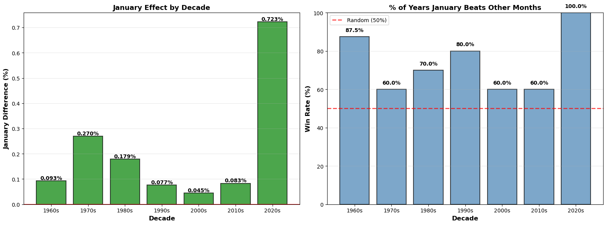
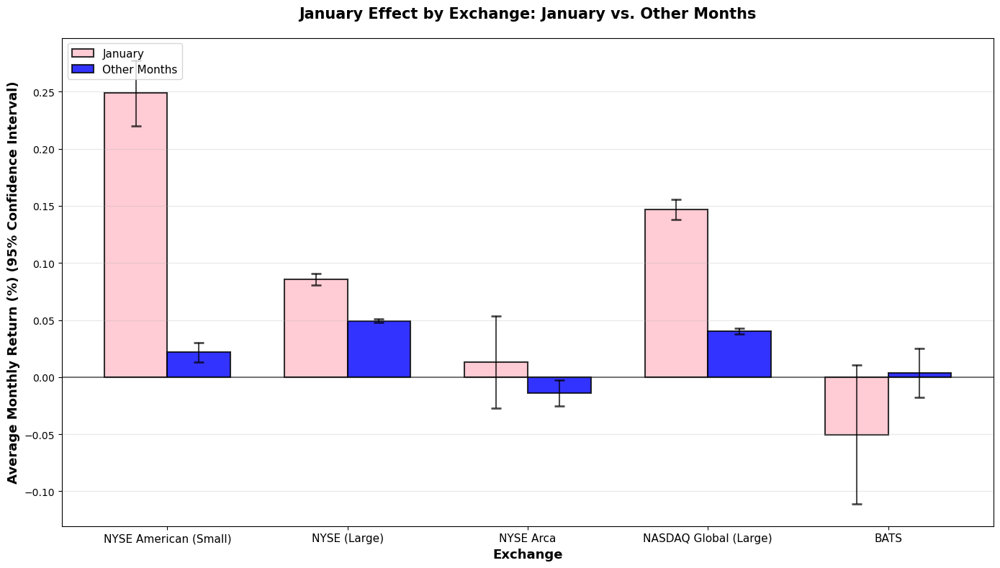
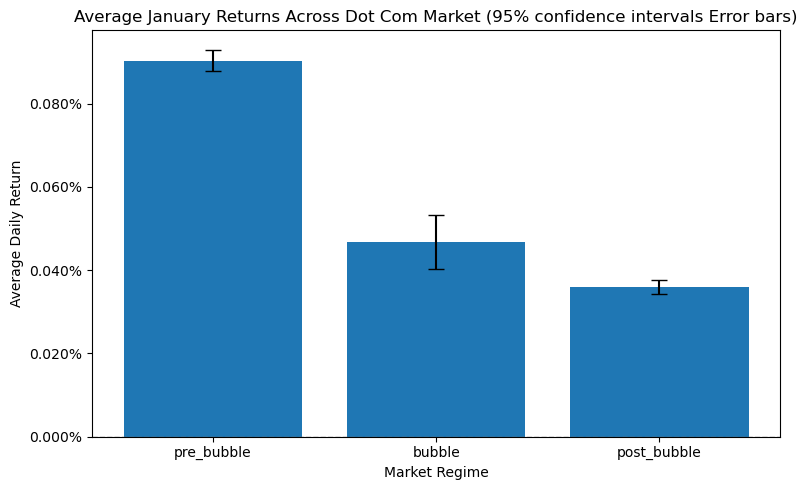
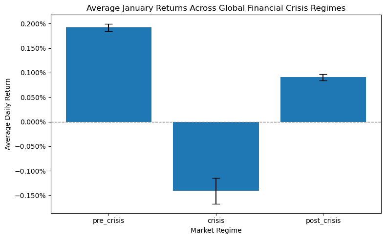
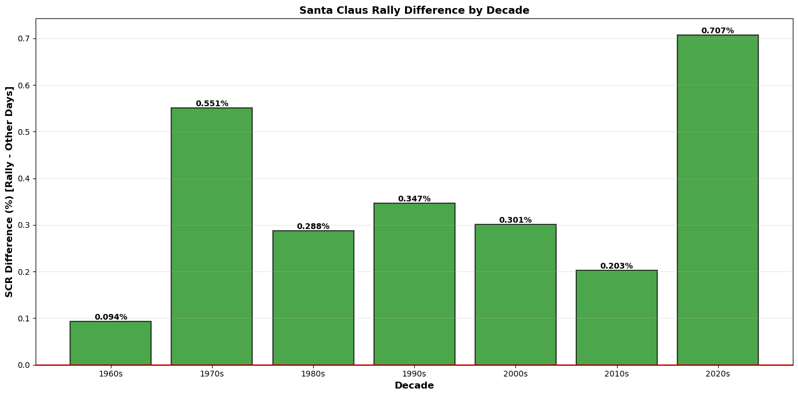
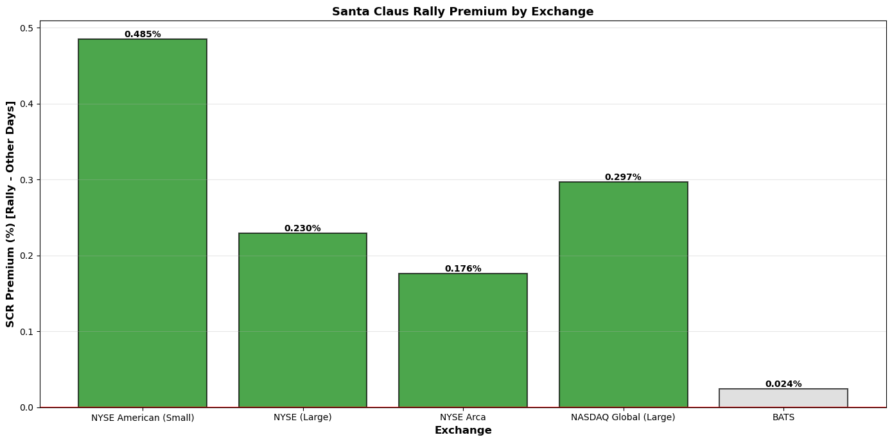
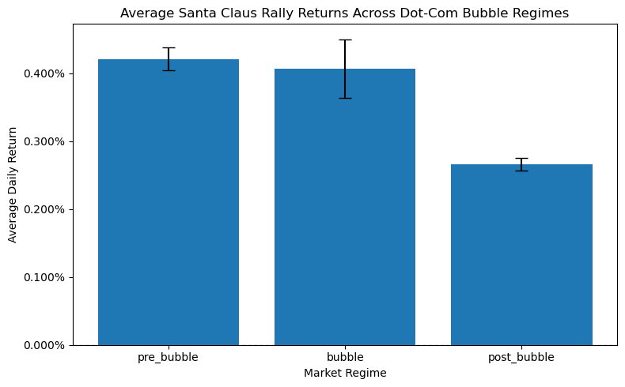
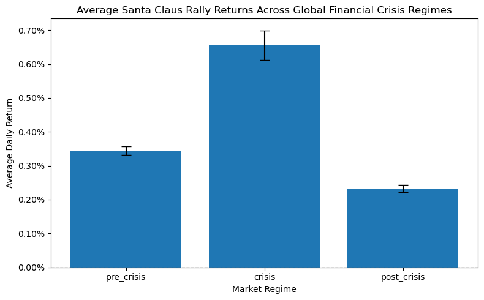

<section class="hero-header">
  

  

    <h1>Market Detectives – Investigating Calendar Effects</h1>
    
Analyzing Seven Calendar-Effect Anomalies in NASDAQ Since 1962

  

</section>



# Market detectives

Over the past decades, academic studies and market commentary have documented recurring patterns in stock returns linked to the calendar. These so-called calendar effects have sparked long-standing debates about their existence, persistence, and economic relevance
Despite the large body of literature, there is still no clear consensus on whether these effects represent genuine market inefficiencies or merely statistical artifacts that fade once widely known. Some studies argue that calendar effects reflect behavioral biases and institutional trading practices, while others suggest that they weaken over time as markets become more efficient. This is when our team of market detectives Furkan, Aitor, Rana, Zouhair and Melvyn appear, also called the FARZM.  

Zouhair

Field investigator 

Melvyn

Analyst & Pattern Specialist

Furkan

Evidence & Forensics Specialist

Rana

Cold Case Detective

Aitor

Interrogation Expert

<strong id="mt"></strong> 

<button class="team5-btn" onclick="c()">Close</button>

The FARZM set out to investigate these calendar effects. Armed with data and a passion for uncovering hidden market truths, FARZM are on a mission: to determine whether calendar effects still hold power in modern and if they exist.
- Monday effect
- January effect
- Santa Claus Rally
- Turn-of-the-Month
- Half-Month
- Halloween effect (“Sell in May”)
- Holiday effect



## Investigating the dataset

  

    Investigating the dataset
  

  

    The investigation begins with the dataset itself: NASDAQ, a technology-heavy
    stock market index. Diving into the NASDAQ data allows us to demystify the
    alleged calendar effects by first understanding the underlying market
    dynamics.
  

<iframe src="assets/img/plot_number_of_companies_per_year.html"
        width="100%"
        height="550"
        frameborder="0">
</iframe>

NASDAQ has transformed dramatically over time, with the number of listed companies climbing from a handful to thousands. While the exchange hosted only a handful of small technology firms in the early 1970s, the number of listed companies expanded rapidly across the decades, especially during the early 1980s, the dot-com period, and the post-2010 tech boom reaching over 5,000 firms by 2020. This evolution reflects major structural changes in the U.S. equity market, including sector diversification, higher listing activity, and increases in trading volume and liquidity.

This trend is especially relevant when looking at calendar effects as these anomalies are known to depend on market structure, liquidity conditions, and the composition of traded firms. A small, low-liquidity NASDAQ dominated by volatile growth stocks (1970s–1980s) may exhibit very different calendar anomalies than the modern, highly liquid and institutionally traded NASDAQ of the 2010s. As the number of listed firms grows, the distribution of returns, the prevalence of small caps, and the level of arbitrage activity all change, which can amplify, weaken, or eliminate calendar effects.

<iframe src="assets/img/plot_volume_per_year.html"
        width="100%"
        height="550"
        frameborder="0">
</iframe>

 What started as modest trading activity in the 1960s has grown into a torrent of market volume by 2020. Overall, trading activity exhibits a strong upward long-term trend, indicating a substantial increase in market participation and liquidity over time. Since calendar effects are often linked to investor behavior and trading activity, failing to account for volume dynamics may confound calendar effect estimate. So incorporating volume as a control variable or analyzing calendar effects within homogeneous sub-periods becomes essential.  
  
<iframe src="assets/img/plot_return_avg_per_year.html"
        width="100%"
        height="550"
        frameborder="0">
</iframe>

Over the 1962–2020 period, annual returns consistently lean positive. It means that returns are positive on average over the long run, despite year-to-year volatility. There are occasional negative returns (for example mid-1970s, late 2000s). Since the unconditional mean return is small, any calendar effects are expected to be weak relative to overall volatility. Moreover, the absence of a strong time trend in average returns supports a key assumption of calendar effect studies: return stationarity over time. This makes the dataset appropriate for isolating return differences attributable to calendar variables rather than structural change. It allows calendar-related differences to be analyzed without being confounded by structural market changes. 

## Getting an initial sense of the calendar effects

The detectives begin with an initial exploratory analysis aimed at visualizing potential calendar effects. 

Profile of each suspect pattern

<noscript></noscript>

## Are the Calendar Effects Real?

  

    Are the Calendar Effects Real?
  

Reinforced by rigorous statistical tools, the detectives conduct an in-depth investigation into each calendar effect. Every suspected anomaly is subjectedto formal hypothesis testing. In particular, Welch’s test, the Mann–Whitney U test, and regression analysis are employed to determine whether statistically significant differences in returns exist between calendar and non-calendar periods. For these tests to be valid, several underlying assumptions must be satisfied, most notably the normality and independence of the data. To ensure the validity of the statistical tests, the investigation begins with a careful assessment of these assumptions, with particular attention paid to the distributional properties of returns.

### Normality Test

Before drawing any statistical conclusions, the detectives examine a crucial assumption that underlays many of the classical hypothesis tests: **the normality of returns**.

Many standard tests used in finance rely on the idea that returns follow a normal distribution. However, daily stock returns are often characterized by **heavy tails, skewness, and occasional extreme events**, especially during periods of market stress or crisis.

To verify these assumption, we formally test the normality of returns for each calendar-effect window using the D’Agostino–Pearson omnibus test, which jointly evaluates skewness and kurtosis. The resulting statistic follows a chi-squared distribution with two degrees of freedom and its corresponding control period. In other words, we ask a simple but fundamental question:

> **Do stock returns within these calendar periods have a bell shaped battern?**

This would help the detectives choose the appropriate test for their investigations, because if returns deviate strongly from normality, mean-based tests alone may be misleading, as a small number of extreme observations can dominate the results.

  
<strong>Hypotheses</strong>

$$
H_0:\ \text{the data are normally distributed}
\qquad
H_1:\ \text{the data are not normally distributed}
$$

  
<strong>Equations for the normality test</strong>

  

#### Sample moments

Given observations $$ x_1, \dots, x_n $$, the central moments is defined as:
$$
m_k = \frac{1}{n} \sum_{i=1}^n (x_i - \bar{x})^k
$$
From these, we compute:

- **Sample skewness**

$$
g_1 = \frac{m_3}{m_2^{3/2}}
$$

- **Sample excess kurtosis**

$$
g_2 = \frac{m_4}{m_2^2} - 3
$$

---

#### Standardize skewness and kurtosis

The skewness and kurtosis statistics are transformed into approximately
standard normal variables:

$$
Z_1 = \text{skewtest}(g_1, n)
$$

$$
Z_2 = \text{kurtosistest}(g_2, n)
$$

---

#### Omnibus test statistic

$$
K^2 = Z_1^2 + Z_2^2
$$

  

Across all calendar effects considered being investigated we got a $P-value = 0.000$. Thus, the normality hypothesis is consistently rejected which aligns with well-established evidence in financial economics: stock returns are not normally distributed.

Rather than being a setback, this result plays an important role in the investigation. It urges the detectives to **go beyond a single testing framework**. While mean-based tests can still provide useful insights in large samples, they must be complemented with **distribution-free methods** that remain valid even when normality fails.

With this in mind, the investigation proceeds using two different approaches:
- a **mean-comparison approach** (Welch’s *t*-test), and  
- a **rank-based, non-parametric approach** (Mann–Whitney U test),

allowing us to distinguish between calendar effects driven by **systematic shifts in typical returns** and those driven by **rare but extreme market movements (in other words outliers in the dataset)**.

### Welch's Test

  

  

    

      The detectives specifically chose the Welch’s Test because, unlike the standard <em>t</em>-test, it can accommodate
      data with unequal variances and unequal sample sizes, making it a more appropriate and conservative choice for
      financial return data. When investigating a calendar-effect window, returns are typically compared with those
      observed during the remainder of the year. Although daily stock returns are not normally distributed, the large
      sample size of daily NASDAQ data (~24 million records) ensures that sample means are approximately normal by the
      Central Limit Theorem, making mean-based tests valid. As a result, Welch’s <em>t</em>-test provides a robust benchmark
      for evaluating whether calendar-effect average returns are statistically significant, directly addressing the core
      economic claims behind calendar effects while minimizing false positives driven by volatility differences or
      sample imbalance.
    

  

  
<strong>Hypotheses</strong>

$$
H_0:\ \mu_1 = \mu_2
\qquad
H_1:\ \mu_1 \neq \mu_2
$$

  
<strong>Equations of Welch's Test</strong>

Given:
- $$ \bar{x}_1, \bar{x}_2 $$ = sample means  
- $$ s_1^2, s_2^2 $$ = sample variances  
- $$ n_1, n_2 $$ = sample sizes  

The Welch *t*-statistic is defined as:

$$
t
=
\frac{\bar{x}_1 - \bar{x}_2}
{\sqrt{\dfrac{s_1^2}{n_1} + \dfrac{s_2^2}{n_2}}}
$$

<!-- 

  
 
    
<b>Central Limit Theorem</b>
     
      
The Central Limit Theorem (CLT) is a cornerstone of statistics, stating that the distribution of sample means from any population will approach a normal distribution as the sample size gets large, regardless of the original population's shape. This convergence to normality, usually with samples of 30 or more ($$ n \geq 30$$).
      
 
  

 -->

  
<strong>Central Limit Theorem</strong>

        The Central Limit Theorem (CLT) is a cornerstone of statistics, stating that the distribution of sample means from any population will approach a normal distribution as the sample size gets large, regardless of the original population's shape. This convergence to normality, usually with samples of 30 or more ($$ n \geq 30$$).

After investigating all the calendar effect's windows using the Welch’s t-test, the detectives found an interesting lead in their story. The test rejects the null hypothesis of equal mean returns for all calendar effects, with reported *p-values* effectively equal to zero. This outcome reflects overwhelming statistical evidence that average returns differ between calendar and non-calendar periods; however it still doesn't prove casuality. The investigators also had to keep i mind that, given the extremely large sample size of daily NASDAQ data, even very small mean differences become statistically detectable causing this high signifigance result. As a result, they interperet these findings as evidence of statistical significance rather than economic magnitude. The detectives decides that the presence of the highly significant *p-values* does not imply that calendar effects are large, stable, or economically meaningful, which motivates them to go for another independent witness as well. 

### Mann–Whitney U Test

  

  

    

      To determine whether calendar effects reflect a systematic shift in the distribution of returns, rather than the effect of rare outliers, the detectives call in a second independent witness: the Mann–Whitney U test. Unlike Welch’s test, Mann–Whitney does not rely on normality distribution assumptions and does not compare averages. Instead, it evaluates whether returns from one calendar period tend to be consistently higher or lower than those from another period across the entire distribution.
    

    

      They hope that by interviewing a mean-based witness and a rank-based one, it would help them distinguish between calendar effects driven by behavioral patterns and those driven by a few rare market events.
    

  

  
<strong>Hypotheses</strong>

When investigating the calendar effects for most of the suspects, the investigators have the hypothesis that the returns during the calendar windows are higher than the rest of the data; however in the Middle of the month effect they assume the opposite acording to it's definition. Finally, when testing the Monday effect, the make a pair-wise test between the 5 trading daysof the week.
$$
H_0:\ \mu_1 = \mu_2
\qquad
H_1:\ \mu_1 \neq \mu_2
$$

  
<strong>Equations of Mann–Whitney U Test</strong>

When both samples are large (typically $n_1, n_2 \gtrsim 20$), the Mann–Whitney $U$ statistic is approximately normally distributed.

$$
\mu_U = \frac{n_1 n_2}{2}
$$

$$
\sigma_U = \sqrt{\frac{n_1 n_2 (n_1 + n_2 + 1)}{12}}
$$

$$
Z = \frac{U - \mu_U}{\sigma_U}
$$

Again like the Welch's test the investigators got *p-values* that were almost zero in most of the calendar effects, which as they already knew is because of the very large number of samples  which makes the tiny and economically negligible differences between return distributions become statistically detectable. In other words, the test provides overwhelming statistical evidence that returns inside those calendar windows are not drawn from the same distribution as returns outside the window, but it does not tell us whether the effect is meaningful in practice. 

On the other hand, the Middle of The Month window got a *p-value* of 1, which indicated that there is no significant difference between the returns during the middle of th emonths compared with the rest of the days. This was their first interesting lead that *Middle of The Month* might not be a criminal after all.

Finally, the test between Wednesday and Thursday got a *p-value* of 0.25, which also rejects the null hypothesis and indicates that there is not significant difference between the returns of both days. However, to recall the Monday effect; the investigaros assumes that the difference would only be beween Monday, Friday, and the rest of the days. Since, the original crime is that returns of Fridays are the highest, Mondays are the lowest, and the rest of the week are almost similar. This is still an interesting lead as it showed that a huge part of the assumption is correct which is the similarity between Wednesday and Thursday.

Finally, after investigating these two witnesses and having almost a *p-value* equal to zero in most of the calendar effect windows, the investogators reached a conclusion: with massive datasets, statistical significance is cheap and not enough. So to have more clues that can help them tighten their analysis, they decided to interview another witness and ask him about the effect sizes.

### Probability of Superiority
Since the investigators began to doubt that the clues and samples they have might be directing them in the wrong direction or can be misleading, they decide to bring the *Probability of Superiority* to the case, and ask him about the effect sizes of the previous witnesses. They believe that this would help them support the previously exagerated conclusioned they had.

  
<strong>Equation</strong>

The probability that previous witnesses ranked a randomly chosen sample from the calendar window higher than another randomly chosen one from the rest of the data
$$
\text{PS} = \frac{U}{n_1 n_2}
$$
        

After a thorough examination of this witness, the investigators uncover a revealing pattern. First, most of the calendar effects yielded a probability of superiority ranging between 45% to 55%, indicating that returns inside these windows are only marginally bigger than the returns from outside the window. This also imply an overlap between distributions, which suggest that while these effects can be statistically detectable, their practical impact is most likely weak.

One exception clearly to that though. The Halloween effect displays a probability of superiority of 73%, in other words in nearly three out of four pairwise comparisons, returns during the Halloween window are begger than those outside it. This represents a large and systematic distributional shift, that can be only due to sampling noise or rare tail events.

This contrast reveals an important distinction: while most calendar effects have statistical significance which is amplified by large sample sizes, the Halloween effect so far is a genuine and economically meaningful anomaly.

In the graph below you can choose a calendar effect to see the results of each of the tests. :)

  <!-- =========================
       1) METRIC EXPLORER
  ========================== -->
 

  <!-- =========================
       2) SIGNIFICANCE RING
  ========================== -->
  

    
Calendar Effects — Significance Ring

    
Choose a test, then click an effect on the ring.

  

  

    

      

        <label>Test</label>
        <select id="ring_testSelect">
          <option value="ttest">t-test</option>
          <option value="mwu">Mann–Whitney U</option>
        </select>
      

    

    

    

  

### Linear Regression

  

    Linear Regression
  

  

  

  To further assess the presence of calendar effects, linear regression models
    are employed to quantify the relationship between calendar indicators and
    asset returns. This approach allows us to control for confounding factors and
    evaluate whether calendar-related variables retain explanatory power once
    standard market dynamics are taken into account.
     After all these very inconclusive investigations, the detectives couldn't
    stop here. They had to find other accomplices that might have helped the
    suspects to further examine whether calendar effects leave a systematic
    imprint on market returns or not. For that, they chose the linear regression
    framework. This approach helps them to quantify the average effect of each
    calendar indicator on daily returns while controlling for market conditions
    such as volatility and trading volume, and interest rates obtained from the
    published Fed funds dataset. By exploiting the full sample of available data,
    the regression provides both an estimate of the magnitude of each effect and
    a measure of its statistical significance.

  
<strong>Linear Regression</strong>

A supervised statistical model in which the expected value of the response variable is modeled as a linear combination of explanatory variables.
  
In our setting, the model relates daily stock returns to calendar-effect indicators and control variables such as volatility, interest rates and trading volume. The coefficients capture the average change in returns associated with each calendar effect, holding other factors constant.

These are the equations they are tryping to achieve using the linear regression:

$$
\text{Return}_t
=
\beta_0
+
\beta_1 \,\mathbb{1}_{\text{Calendar Effect}_t}
+
\beta_2 \,\text{Volatility}_t
+
\beta_3 \,\text{Volume}_t
+
\varepsilon_t
$$

and

$$
\text{Return}_t
=
\beta_0
+
\beta_1 \,\mathbb{1}_{\text{Calendar Effect}_t}
+
\beta_2 \,\text{Interest Rate}_t
+
\varepsilon_t
$$

Now you might ask why they have two different equations, this mainly depends on the clues they have as they don't behave the same way.

When studying trading volume and volatility, they found that the data have lots of dependencies. First, the stocks tend to move together on the same trading day, so they might affect each other. In addition to that, stock also exhibits persistence over time meaning the returns of the same stock from previous days can affect its daily return. Thus, treating these observations as independent would give us a false sense of certainty. To avoid more confusion, they decided to choose a regressions with standard errors clustered both by ticker and by date, this allows the model to account for big events that cann affect the whole market or stock specific events.

On the other hand, interest rates have a completely different behaviour. Unlike volume or volatility, they do not vary across stocks and evolve only over time. Applying the same clustering strategy here would add noise rather than controlling it. For this, they decide to use heteroskedasticity and autocorrelation consistent (HAC) standard errors instead, which are specifically designed to handle serial dependence in time series.

By tailoring their regression approach to the structure of each clue, they ensure that any remaining calendar effects they uncover are not caused by the data’s dependence, but genuine signals worthy of further tests and efforts.

Keep in mind that at this stage, the detectives are not trying to to forecast returns, but to measure whether calendar indicators leave a systematic average imprint on the data once market conditions and dependence structures are controlled. More complex models could capture nonlinear patterns or higher-order dynamics, but they would come at the cost of interpretability and would risk fitting noise rather than signal. That's why although they have a *R-Squared* value equal to zero in all the following models. they still believe it was the model that suited the the best.

  
<strong>Linear Regression Summaries and comments</strong>

  
Choose Time Series for interest rate regression, or Clustering for volume and volatility.

  <!-- ================= TIME SERIES ================= -->
  

    
<strong>Time Series</strong>

    

      

        
<b>📉 January Effect</b>

        

          
        

        

          The January effect becomes statistically significant once interest rates are controlled for and serial correlation is addressed using HAC standard errors which means that it managed to survive the serial correlation correction. On the other had, fed funds have a negative coffiecient and a p-value > 0.5 which makes it insignificant.That being said, the model still explains only a very small fraction of daily return variation it only suggets that January have a very faint yet persistent footprint in the data.
        

      

    

    

      

        
<b>🎅 Santa Claus Rally Effect</b>

        

          
        

        

           Santa Claus Rally has higher average returns by around 0.25%, it survives the correction for the serial correlation. That also means that it can't be explained by interest rates as they have a very small and negative coffiecient value with a p-value that is passes the significance threshhold. Now the detectived can assume that from a time series prespective, tha Santa claus Rally leave a significant footprint.
        

      

    

    

      

        
<b>🎃 Halloween Effect</b>

        

          
        

        

           Returns are regressed on a winter (Nov–Apr), controlling for the Fed Funds rate. A positive and statistically significant winter coefficient is found, indicating higher returns during winter months. The Fed Funds rate is not statistically significant, suggesting that this seasonal pattern is not driven by interest rate conditions.
        

      

    

    

      

        
<b>🎉 Holiday Effect</b>

        

          
        

        

           The pre-holiday coefficient is positive and highly significant (about +0.25%), meaning returns are clearly higher on days just before holidays. The interest rate variable is not significant, so interest rates do not seem to explain the holiday effect. Overall, the Holiday effect stays positive and strong even after accounting for the federal funds rate.
        

      

    

  

  <!-- ================= CLUSTERING ================= -->
  

    
<strong>Time Clustering</strong>

    

      

        
<b>📉 January Effect</b>

        

          
        

        

            While the estimated coefficient suggests that returns in January are one average slightly higher, the p-value is below 0.5 which makes it significance fragile. The effect is just outside the thresholds, hinting that there might have been a possible pattern but it fails to make a decisive conclusion. Once volatility and trading volume are taken into account, neither variable shows a statistically meaningful relationship with returns. This suggest that while the January effect may leave a faint trace in the data, it is far from being reliable.        

      

    

    

      

        
<b>🎅 Santa Claus Rally Effect</b>

        

          
        

        

            The coefficient is positive, and it has a significant p-value. Santa clause rally survives controlling the volume and volatility which both has a very high p-value so the detictives can assume that they doesn't justify the santa claus battern in the stocks. This makes this anomaly more genuine rather than being a noise.
        

      

    

    

      

        
<b>🎃 Halloween Effect</b>

        

          
        

        

           Volatility and trading volume are added as controls in the regression. The winter coefficient remains positive but becomes weaker and less statistically significant. This suggests that higher winter returns are partly related to changes in market volatility and trading activity, rather than seasonality alone.
        

      

    

    

      

        
<b>🎉 Holiday Effect</b>

        

          
        

        

           The pre-holiday effect is positive and significant (around +0.20%), meaning returns are higher right before holidays. Volatility and trading volume are not significant, so they don’t explain this pattern.
The Holiday effect stays positive and noticeable even after accounting for volatility and volume.
        

      

    

  

<!-- ===============================
     DEEP INVESTIGATION BANNER
     =============================== -->
<section style="
  margin:4.5rem 0;
  padding:2.4rem 2.6rem;
  border-radius:24px;
  background:
    linear-gradient(120deg, rgba(0,0,0,.65), rgba(0,0,0,.35)),
    url('assets/img/perry_CNN.png') center/cover no-repeat;
  color:#fff;
  box-shadow:0 22px 55px rgba(0,0,0,.25);
">

  

    

      NEXT STEP
    

    <h2 style="
      font-size:2.2rem;
      font-weight:900;
      margin:0 0 .6rem;
      line-height:1.15;
    ">
      A deeper investigation — effect by effect
    </h2>

    

      The high-level patterns are revealed.
      Now you can go further — inspect each calendar effect in detail,
      explore company-level behavior, and trace when an effect holds
      and when it breaks down.
    

    

      Company-level distributions

      Parameter exploration

      Stock-by-stock timelines
    

  

</section>
The big picture has given us the first clues. One clue, however, quickly falls apart under closer inspection. For the Half-Month effect, the Welch test returns a p-value equal to 1, well above any reasonable significance threshold. This means that, despite some apparent and suspicious visual patterns in the data, the effect does not hold up statistically. This leads us to rule out the Half-Month effect: what initially looks like a pattern is more likely random noise rather than a reliable market behavior. Each calendar effect that passed the statistical tests is examined individually to uncover where it truly holds, where it fades, and where it breaks down. We zoom in from market-wide averages to the company level, looking at how different stocks react to the same calendar patterns. By analyzing distributions stock by stock, and studying the behavior of each effect across major financial crises, we trace how these calendar effects survive, weaken, or disappear under stressed market conditions.

<!-- ===============================
     MONDAY EFFECT
     =============================== -->
<section class="effect" id="tom">
  <h2>Monday Effect</h2>
  
Is the return the lowest on monday?

  

  

    
Detective Questions

    
What to look for

  

  <ul>
    <li><b>Across decades:</b> Is the effect real?Does each day of the week have an impact on the return?</li>
    <li><b>Across exchanges:</b> Does each day of the week have an impact on the return?</li>
  </ul>

  

    <button class="active" data-lens="decades">Reality check</button>
    <button data-lens="exchanges">Across Time</button>
  

  <!-- ========== Across Decades ========== -->
  

    <iframe src="assets/img/avg_return.png"></iframe>
    

        We can see that indeed when we calculate the average return of each day since the history of the Nasdaq, the lowest average return is on Monday, it is the only negative one, and the highest is on Friday. However, it's important to perform statistical analysis to determine if this is a coincidence or not. First, we would like to check that each weekdays follow a different distribution, this would be  a solid indice to the fact that the weekday has an impac. To verify this, we will first plot the kde of the distributions and then we will perform the Mann-Whitney test to each pair of weekday.
    

<iframe src="assets/img/kde_weekday.png"></iframe>
<iframe src="assets/img/mannwhitneyu.png"></iframe>
  

    We can immediately see that we can say that all the weedays have a distinct distribution except wednesday end thursday. We will plot the logscale to have more insights.
  

        <iframe src="assets/img/logmannwhitneyu.png"></iframe>
  

    It is now more clear that the most different distributions are the monday and the friday ones, which corresponds to the theory of the Monday effect.
    Now that we know that most of the days have an unique distribution, we are interested by the average of those distributions. To compare the average distributions we will apply the Welch's t-test o the averages of the different days. Since we are measuring the average, according to the central limit theorem it should follow a normal distribution and we can therefore use the Welch's t-tes.
  

  <iframe src="assets/img/ttest.png"></iframe>
  

  And the logscaled.
  

  <iframe src="assets/img/logttest.png"></iframe>
    

    As expected, Wednesday and Thursday do not have a statistically significant difference in their averages. Other pairs of days, such as Thursday and Tuesday or Wednesday and Friday, also show no significant difference. However, Monday stands out with a statistically significant difference in its average with all the other days. Therefore, we can conclude that, except for Wednesday and Thursday, each day of the week on the Nasdaq tends to follow a distinct distribution, with Monday's average return being significantly lower than that of the other days.
  

  

  <!-- ========== Across Exchanges ========== -->
  

    

      To see the evolution of the monday effect across the time we will therefore first display the evolution of the average return by decade and by day.
    

<iframe src="assets/img/moday_effect_decades.png"></iframe>
    

      We can see that the return on monday has been lower each decade, and Friday has always been the highest. The other days, however, do not seem to follow any particular pattern.
  We will now group all weekdays whose averages cannot be statistically distinguished using Welch's t-test for each decade.
    

  <iframe src="assets/img/plot_ttest_monday.html"
      width="100%"
      height="550"
      frameborder="0">
</iframe>

  We can see that the days of the week have consistently exhibited distinct averages, except for a brief period between 2000 and 2010 when the difference between Monday and Tuesday was not statistically significant.

</section>

<!-- ===============================
     JANUARY EFFECT
     =============================== -->
<section class="effect" id="january">
  <h2>January Effect</h2>
  
Does January outperform the rest of the year?

  

    

      
Detective Questions

      
What to look for

    

    <ul>
      <li><b>January premium:</b> Is January return higher than the rest of the year?</li>
      <li><b>Stability:</b> Does it show up across multiple decades?</li>
      <li><b>Small vs large:</b> Does it concentrate in certain exchanges?</li>
      <li><b>Crises:</b> Does January behave differently in Dot-Com / GFC?</li>
    </ul>
  

  

    <button class="active" data-lens="decades">Across Decades</button>
    <button data-lens="exchanges">Across Exchanges</button>
    <button data-lens="dotcom">Dot-Com Bubble</button>
    <button data-lens="gfc">Global Financial Crisis</button>
  

  

    <!-- <iframe src="assets/img/plot_monday_decades.html"></iframe> -->
    
     

      In the 2020s, we can see that we have a 100% win rate, that is because in this case we are only analysing the first 4 months in 2020. We also have to keep in mind that early January is considered pre-COVID; however rest of January, March, and April are during the peak of the pandamic so the market was unstable at that period it also justify why the returns of that year are all negative.
  In the first graph we basically can see the curve declining as the Januarry effect deacreses as the time passes which is mostly due to the dot com bubble and the emergence of algorithm based trading which caused the seasonaly anomoulies like January effect to decrease.
The reason why graph started to go up again in 2010s is mostly due to the financial crisis at that time; however, as we discussed before the 2020s bar is a special case since it is just a 4-months analysis and not a decade like te rest.
       We can also see see that the win rate where January returns exceed the other month returns are higher than 50%. This shows that eventhough January is in not always exceeding the other months, there are still very high chances that it will happen.
    

  

  

        
    

      We find in the graph that the results are not significant in the Arca and BATS stock exchange which makes sense because Arca mainly focuses on the etfs which are not analyzed here. On the other hand, BATS (Better Alternative Trading Systems) is a semi-profitable utility that was introduced to make the NASDAQ index more nuetral. It also have 17 companies only, which makes it very small compared to the other exchanges.
      However, this graph confirms the caim of the january effect that for small and mid-capital companies we have the most January effect compared to others; however we can still see that it is significant in global and large companies as well.
    

  

  

        
    

      January returns before the dot com bubble are statistically very different from those during the bubble. January returns did not change immediately after the bubble post bubble as it is still differ significantly from bubble years. However from last test we can conclude that: The January effect observed before the 1990s no longer characterizes modern markets.
    

  

  

        
        

          The Global Financial Crisis represents a clear break in January’s historical behavior. January performance improves after the crisis, but this improvement is statistically distinct from crisis behavior. However even after recovery, January returns remain significantly different from the period before the crisis.
      Average January returns turn sharply negative during the Global Financial Crisis and only partially recover afterward, suggesting a lasting disruption to the January effect
        

  

</section>

<!-- ===============================
     SANTA CLAUS RALLY
     =============================== -->
<section class="effect" id="santa">
  <h2>Santa Claus Rally</h2>
  
Is there really a year-end rally?

  

    

      
Detective Questions

      
What to look for

    

    <ul>
      <li><b>January premium:</b> Is Santa Claus Rally return higher than the rest of the year?</li>
      <li><b>Stability:</b> Does it show up across multiple decades?</li>
      <li><b>Small vs large:</b> Does it concentrate in certain exchanges?</li>
      <li><b>Crises:</b> Does January behave differently in Dot-Com / GFC?</li>
    </ul>
  

  

    <button class="active" data-lens="decades">Across Decades</button>
    <button data-lens="exchanges">Across Exchanges</button>
    <button data-lens="dotcom">Dot-Com Bubble</button>
    <button data-lens="gfc">Global Financial Crisis</button>
  

  

    
    <!-- iframe here -->
    

      Here we can see that the santa claus rally has had a strong presence in the market since the 1970s. There is a potential decline happening starting from the 1990s; however it is still significant compared to other trading days of the week. Here as well 2020s in a specal case since it is only 4 months, an most likely it had the highest difference because of COVID related volatility and market unstability.
    

  

  

    
    

      Here again like the January effect we can see that the santa claus rally is mostly significant in smal and mid cap companies compared to the others. This strongly aligns with the historical expectation that market anomalies tend to be strongest in less efficient, smaller-capitalization stocks. The effect that appears in the NYSE Arca here is likely drived by negative returns throughout the year but this part still needs more analysis as well.
    

    <!-- iframe here -->
  

  

    
    

      The bubble itself did not materially change the strength of the Santa Claus Rally. If the rally existed before, it seems to have continued in a similar way during the bubble. However it behaves very differently in the post-bubble period compared to during the bubble. This suggests a structural break rather than random fluctuation.
    

    <!-- iframe here -->
  

  

      
    

Average daily Santa Claus Rally returns across Global Financial Crisis regimes reveal a pronounced increase during the crisis period, followed by a post crisis decline. The limited overlap of 95% confidence intervals suggests statistically meaningful period differences, consistent with Welch and Mann–Whitney test results. These findings indicate that the Santa Claus Rally is not only persistent but moving in the opposite direction of the overall market cycle, strengthening during periods of elevated market stress.
    

    <!-- iframe here -->
  

</section>

<!-- ===============================
     TURN OF THE MONTH EFFECT
     =============================== -->
<section class="effect" id="tom">
  <h2>Turn-of-the-Month Effect</h2>
  
Do stock returns spike around the turn of the month?

  

  

    
Detective Questions

    
What to look for

  

  <ul>
    <li><b>Across decades:</b> How stable is the effect over time? Does its strength increase, weaken, or disappear across different decades?</li>
    <li><b>Across exchanges:</b> Is the effect consistent across major stock exchanges, or does it vary depending on market structure or region?</li>
  </ul>

  

    <button class="active" data-lens="decades">Across Decades</button>
    <button data-lens="exchanges">Across Exchanges</button>
  

  <!-- ========== Across Decades ========== -->
  

    <iframe src="assets/img/plot_tom_effect_by_decade.html"></iframe>
    
 We observe that the average return for both the turn-of-the-month window and the rest of the days decreases across decades, although both remain positive. 
    The TOM effect is particularly strong between 1991 and 2000, with an average return of about 0.2% compared with roughly 0.05% for the rest of the days. 
    In the most recent decade, the difference persists but at much lower magnitudes: around 0.04% for TOM versus 0.007% for the rest.

  

  <!-- ========== Across Exchanges ========== -->
  

    <iframe src="assets/img/plot_tom_by_exchange.html"></iframe>
    
 For each exchange type, we observe a clear difference in returns between the turn-of-the-month window and the rest of the days. The effect appears strongest on NYSE American, where the return gap reaches approximately 0.12%. On the other end of the spectrum, BATS shows the weakest TOM effect, with a difference of roughly 0.02%.

  

</section>

<!-- ===============================
     HALLOWEEN EFFECT (SELL IN MAY)
     =============================== -->

     
<!-- ====== Media styling: make January look like Halloween ====== -->

<!-- ===============================
     HALLOWEEN EFFECT (SELL IN MAY)
     =============================== -->
<section class="effect" id="halloween">
  <h2>Halloween Effect (Sell in May)</h2>
  
Winter vs summer market performance.

  

    

      
Detective Questions

      
What to look for

    

    <ul>
    <li><b>Across decades:</b> Is the winter–summer return gap positive in most decades?</li>
    <li><b>Across exchanges:</b> Does the effect appear across different stock exchanges?</li>
    <li><b>Heatmap view:</b> Do winter months show stronger returns across years?</li>
    <li><b>Volatility regime:</b> Is the gap different in high- and low-volatility periods?</li>
    <li><b>Year by year:</b> In how many years does winter outperform summer?</li>
    <li><b>Crisis zoom:</b> Does the effect become stronger during market crises?</li>
    </ul>
  

  

  

    <button class="active" data-lens="decade">Across Decades</button>
    <button data-lens="exchange">Across Exchanges</button>
    <button data-lens="heatmap">Heatmap</button>
    <button data-lens="volatility">Volatility Regime</button>
    <button data-lens="yearbyyear">Year by Year</button>
     <button data-lens="crises">Crisis Zoom</button>
  

  <!-- CONTENTS -->
  

    
    

      This bar chart shows the Sell in May effect by decade. Each bar represents the total difference between winter and summer returns for a given decade.
      From the figure, we can see that the winter–summer return difference is positive in all decades. This means that winter returns are higher than summer returns across different time periods.
      The strength of the effect changes over time, with stronger differences in the 1970s, 1980s, and 2010s, and weaker differences in the 1990s and 2000s.
      Overall, the chart suggests that the Sell in May effect is persistent across decades, even though its magnitude varies over time.
    

  

  

    
    

      This boxplot compares the Sell in May effect across different stock exchanges. For each exchange, the plot shows the distribution of the percentage of years in which winter returns are higher than summer returns.
      From the figure, we can see that the median value is above 50% for most exchanges. This means that, on average, winter outperforms summer in more than half of the years across different markets.
      However, the spread differs by exchange, and some markets show more variation than others.
      Overall, the results suggest that the Sell in May effect is present across exchanges, but its strength is not the same in every market.
    

  

  

    
    

      This heatmap shows monthly market returns across different years. The colors represent average returns, where red indicates positive returns and blue indicates negative returns.
      From the figure, we can see clear differences across months and years. Some months show more frequent positive returns, while others are more mixed or negative.
      In particular, months in the winter period tend to show stronger and more stable performance compared to many summer months.
      Overall, the heatmap shows that monthly returns change depending on the season.
    

  

  

    
    

      This figure shows average monthly returns for winter and summer under different volatility conditions. The points represent the mean returns, and the vertical lines show the 95% confidence intervals.
      In both high-volatility and low-volatility periods, winter returns are higher than summer returns. The difference is larger during high-volatility periods.
      In low-volatility periods, the gap becomes smaller, but winter still performs better.
      Overall, the figure suggests that the Sell in May effect is stronger when market volatility is high and weaker when volatility is low.
    

  

  

    
    

      The figure shows the yearly return difference between the winter period and the summer period. The data covers 58 years.
      In 45 years, winter returns are higher than summer returns, while in 13 years the opposite happens.
      To support this observation, a one-sample t-test is applied. The obtained p-value is about 0.0001, which is much smaller than 0.05.
      Therefore, we reject the null hypothesis. This result shows that the higher winter returns are not due to random chance.
      In conclusion, the Sell in May (also called the Halloween) effect is clearly observed in the NASDAQ data.
    

  

  

    
    

      From the graph, we can see that winter returns are positive in all crisis periods, while summer returns are negative or close to zero.
      This pattern appears during the Dot-com Bubble, Black Monday, and the Global Financial Crisis.
      Overall, the figure suggests that during crisis periods, winter performs much better than summer.
      This means that the Sell in May (Halloween) effect becomes more visible in times of market stress.
    

  

</section>

<!-- ===============================
     HOLIDAY EFFECT
     =============================== -->
<section class="effect" id="holiday">
  <h2>Holiday Effect</h2>
  
Do stock returns behave abnormally around public holidays?

  

    

      
Detective Questions

      
What to look for

    

    <ul>
    <li><b>Across decades:</b> Does the Holiday effect persist over time, or does it weaken as markets become more efficient?</li>
    <li><b>Across exchanges:</b> Is the Holiday effect consistent across different equity exchanges, or does it mainly appear in specific markets?</li>
    <li><b>Crashes and crises:</b>Does the Holiday effect survive during market crashes and major financial crises, or does it break down under extreme conditions?</li>
    </ul>
  

  

    <button class="active" data-lens="decades">Across Decades</button>
    <button data-lens="years">Across Years</button>
    <button data-lens="crises">Crashes &amp; Crises</button>
  

  <!-- ========== Across Decades ========== -->
  

    <iframe src="assets/img/plot_holiday_effect_by_decade.html"></iframe>
    

      Looking at the chart, a clear pattern stands out. Across all decades, returns tend to be higher
      on days before holidays than on normal trading days. However, what once looked like a strong and
      regular market behavior gradually becomes less pronounced, hinting that the market may have adapted
      to this seasonal tendency.
    

  

  <!-- ========== Across Years ========== -->
  

    <iframe src="assets/img/plot_holiday_effect_exchange.html"></iframe>
    

      Holiday-related return differences vary across exchanges. The effect appears stronger on
      NASDAQ and NYSE American, while the NYSE is more modest. In contrast, ETFs and BATS/Cboe show
      little to no noticeable holiday effect, suggesting that this pattern is mainly concentrated in
      traditional equity markets.
    

    <!-- Not: Sonra gerçekten year-by-year html üretirsen,
         burada iframe src'yi onunla değiştir. -->
  

  <!-- ========== Crashes & Crises ========== -->
  

    <iframe src="assets/img/plot_crisis_holiday_heatmap.html"></iframe>
    

      During the Dot-Com bubble, performance around holidays turns weak and often negative, especially after
      the break. In contrast, during the Global Financial Crisis, returns around holidays are mostly positive,
      with stronger gains just before the holiday. This suggests the holiday effect can still be visible even
      during stress periods.
    

  

  <!-- ========== Fed Effect ========== -->
  

    <!-- If you export a Fed-related plot later, uncomment and set the correct src:
    <iframe src="assets/img/plot_holiday_fed_effect.html"></iframe>
    -->
    

      

        
Fed Effect plot is not added yet

        
TODO

      

      <ul>
        <li>When you export the Fed-related holiday chart as an HTML file, paste it here as an iframe.</li>
        <li>Use the same style as other plots: <b>assets/img/your_plot.html</b></li>
      </ul>
    

  

</section>

<!-- ===============================
   SURVIVAL SECTION
   =============================== -->

<!-- ---

## A quick reality check

Of course, no dataset is perfect. Prices are observed at daily frequency, and the sample ends in 2020 — meaning the most recent market episodes fall outside our scope.

But for a project focused on **historical regularities and their robustness**, this dataset is more than sufficient. If calendar effects truly shaped market behavior, they should leave footprints here.

And if they don’t?

That’s a result too.

--- -->

  

    <h3>Case Closed</h3>
    

      The investigation is complete. The evidence is on the table.
      Now it’s your turn to explore the data, test individual stocks,
      and challenge the calendar effects.
    

  

## The investigation is complete. The case is now closed.

Our role as market detectives ends here but the real exploration starts now.

We did not aim to deliver a single verdict or a fixed trading rule. Our investigation has provided clear answers to the research questions, while also revealing the limits and conditions under which calendar effects hold.
Instead, we opened the data and built tools that allow you to **inspect calendar effects from multiple angles**.

  

    
Investigation checklist

    
How we judge survival

  

  <ul>
    <li><b>Across decades:</b> visible in many decades, not only one “lucky” period.</li>
    <li><b>Across crises:</b> does not fully collapse in Dot-Com / GFC windows.</li>
    <li><b>Across exchanges:</b> not limited to one tiny market segment.</li>
  </ul>

### Is the effect visible across multiple decades or limited to specific periods?

Across decades, the investigation shows that most calendar effects are not the result of a single lucky period but leave consistent traces over time. The Holiday and Halloween effects persist across many decades, with returns remaining higher in pre-holiday periods and during winter months, even though their strength fluctuates and sometimes weakens as markets evolve. The January effect displays a clearer decay, likely due to market learning and structural changes such as algorithmic trading, yet it does not fully disappear and still shows a higher-than-random chance of outperformance. The Monday effect also remains visible over long horizons, with Mondays consistently underperforming relative to other weekdays. Overall, while the magnitude of these effects changes and often diminishes over time, their repeated presence across decades suggests that they reflect enduring market behaviors rather than pure statistical accidents.

### Do calendar effects survive during major market crashes and financial crises, or do they break down under extreme market stress?

Across major market crashes and crisis periods, calendar effects do not disappear but behave differently under stress. The Holiday effect weakens during the Dot-Com bubble, where post-holiday returns often turn negative, yet it re emerges during the Global Financial Crisis with stronger gains just before holidays, showing resilience even in turbulent times. The Halloween effect becomes especially pronounced during crises. Across the Dot-Com bubble, Black Monday, and the Global Financial Crisis, winter returns remain positive while summer returns are weak or negative, making the Sell in May pattern clearer during periods of market stress. The Santa Claus Rally shows a counter cyclical behavior, strengthening sharply during the Global Financial Crisis before declining afterward, suggesting that it intensifies when market stress is highest. In contrast, the January effect experiences a clear structural break during the Global Financial Crisis. Returns turn sharply negative and only partially recover afterward, indicating a lasting disruption rather than a temporary shock.

### How widespread is the effect across different stock exchanges ?

Across exchanges, the evidence suggests that calendar effects are not confined to a single market, but their strength clearly depends on market structure and capitalization. The January effect and the Santa Claus rally appear strongest in small and mid-cap exchanges, which is consistent with the idea that seasonal anomalies thrive in less efficient markets, while still remaining visible though weaker among large-cap and global stocks. The Turn-of-the-Month effect is present across all exchange types, with particularly strong return gaps on NYSE American and much weaker effects on BATS, highlighting meaningful cross-market differences. The Halloween effect (Sell in May) also persists across exchanges, with winter returns outperforming summer in more than half of the years for most markets, even though the variability of the effect differs by exchange. Finally, the Holiday effect shows a similar pattern: it is more pronounced on NASDAQ and NYSE American, moderate on the NYSE, and largely absent in ETF focused or alternative trading platforms such as NYSE Arca and BATS. Overall, these results indicate that calendar effects are widespread across exchanges, but they tend to be strongest in traditional equity markets and smaller-cap segments, and weaker or absent in more efficient or specialized trading venues. You can see this with your own eyes by zooming into individu
> Is this effect a market-wide phenomenon, or is it driven by only a subset of stocks?

You can explore how the effect behaves under different parameters
(before vs after holidays, crisis periods, or monetary regimes),
and observe how the share of “conforming” companies changes over time.

### Zoom into individual stocks

Once the aggregate picture is clear, the investigation can move one level deeper.

You can select **individual tickers** on the distribution interactive plot and calendar effect explorer by clicking on the effect wanted. So you can track how a specific stock behaved over the years:
when the calendar effect worked, when it failed, and when it reversed.
Some stocks follow the pattern consistently.
Others only exhibit it in certain periods or not at all.

### Draw your own conclusions

After exploring calendar effects across decades, exchanges, individual stocks, and periods of crisis, the investigation reaches its final stage. The evidence has been gathered, cross-checked, and stress-tested under multiple market conditions. What remains is interpretation.

You can now move freely between market-level summaries and stock-level timelines, compare how effects evolve through time, across exchanges, and under extreme stress, and judge for yourself which patterns appear persistent, which ones weaken, and which are likely the result of chance.

Markets rarely offer clear verdicts. They leave traces, hints, and contradictions.

The data is open. The tools are in your hands.
The investigation continues with you.

<section id="calendar-effects" class="fx-wrap">
  

    <!-- LEFT: Effect cards -->
    <aside class="fx-panel">
      

        
Effects

        <input id="fxSearch" class="fx-search" placeholder="Search (jan, may, tom...)" />
      

      

        <button class="fx-card active"
          data-key="january"
          data-title="January Effect"
          data-desc="January average return is higher than the average of Feb–Dec."
          data-img="{{ site.baseurl }}/assets/img/january_company.png">
          
JAN

          

            
January Effect

            
Month seasonality

          

          
classic

        </button>
        <button class="fx-card" 
           data-key="sell" 
           data-title="Sell in May" 
           data-desc="Winter (Nov–Apr) vs Summer (May–Oct) return gap." 
           data-img="{{ site.baseurl }}/assets/img/sell_in_may_company.png"> 
           
MAY
 
 
           
Sell in May
 
           
Season regime
 
           
 
macro
 
        </button>

        <button class="fx-card"
          data-key="holiday"
          data-title="Holiday Effect"
          data-desc="Pre/post-holiday behavior: abnormal returns around holidays."
          data-img="{{ site.baseurl }}/assets/img/New_Year_1.png">
          
HOL

          

            
Holiday Effect

            
Event timing

          

          
event

        </button>

        <button class="fx-card"
          data-key="tom"
          data-title="Turn-of-Month"
          data-desc="Returns around the month switch (end/beginning) are stronger."
          data-img="{{ site.baseurl }}/assets/img/tom_company.png">
          
ToM

          

            
Turn-of-Month

            
Window effect

          

          
timing

        </button>

        <button class="fx-card"
          data-key="monday"
          data-title="Monday Effect"
          data-desc="Monday average return is lower than the other weekdays."
          data-img="{{ site.baseurl }}/assets/img/monday_company.png">
          
MON

          

            
Monday Effect

            
Weekday bias

          

          
week

        </button>

        <button class="fx-card"
          data-key="santa"
          data-title="Santa Rally"
          data-desc="End-of-year rally window: late Dec to early Jan pattern."
          data-img="{{ site.baseurl }}/assets/img/santa_claus_rally_company.png">
          
🎅

          

            
Santa Rally

            
Year-end

          

          
fun

        </button>

      

    </aside>

    <!-- RIGHT: Plot viewer -->
    <main class="fx-viewer">
      

        

          

            
Selected effect

            
January Effect

            
January average return is higher than the average of Feb–Dec.

          

          

            <a id="fxOpenImg" class="fx-open" target="_blank" rel="noopener">Open image</a>
          

        

        
        

          
Choose holiday

          <select id="fxHolidaySelect" class="fx-holiday-select"></select>
        

        

          

          
        

      

    </main>

  

</section>

<!-- ============================================================
  ✅ ONE-PAGE EFFECTS HUB (PIE NAV + COLLAPSIBLE SECTIONS)
  - No analysis/plot logic changed
  - Only wrapped each effect in <section> and added hub + show/hide
============================================================ -->

<!-- Plotly (load once is enough; kept as you had it in places too) -->

<!-- ========== EFFECTS OVERVIEW (Pie Navigation) ========== -->

  

    

      
Calendar Effects Explorer

      
Click a slice to open that effect below. (Others collapse.)

    

    

      <button class="hub-btn" data-open="all">Show all</button>
      <button class="hub-btn" data-open="none">Collapse</button>
    

  

  

    

      
Effects

      

      

    

  

<!-- ============================================================
  ✅ SECTION 1: SANTA (your code unchanged; only wrapped)
============================================================ -->
<section class="effect-section" id="effect-santa" data-effect="santa" data-title="Santa Claus Effect">

  

    

      
Santa Claus Effect (per ticker)

      
Type a ticker and the plot updates instantly.

    

    

      <input id="santaTicker" list="santaTickers" placeholder="Type ticker (e.g., TAPR)" />
      <datalist id="santaTickers"></datalist>
    

  

  

</section>

<!-- ============================================================
  ✅ SECTION 2: SELL IN MAY (your code unchanged; only wrapped)
============================================================ -->
<section class="effect-section" id="effect-sim" data-effect="sim" data-title="Sell in May">

  

    

      
Sell in May (per ticker)

      
Type a ticker to update the two-panel plot.

    

    

      <input id="simTicker" list="simTickers" placeholder="Type ticker (e.g., AAPL)" />
      <datalist id="simTickers"></datalist>
    

  

  

    

      
Ticker view

      

    

    

      
Company distribution

      

      

    

  

</section>

<!-- ============================================================
  ✅ SECTION 3: MONDAY (your code unchanged; only wrapped)
============================================================ -->
<section class="effect-section" id="effect-monday" data-effect="monday" data-title="Monday Effect">

<!-- ============== MONDAY EFFECT (per ticker + pie) ============== -->

  

    

      
Monday Effect (per ticker)

      
Type a ticker to update the two-panel plot. Pie shows distribution across companies.

    

    

      <input id="monTicker" list="monTickers" placeholder="Type ticker (e.g., AAPL)" />
      <datalist id="monTickers"></datalist>
    

  

  

    

      
Ticker view

      

    

    

      
Company distribution

      

      

    

  

</section>

<!-- ============================================================
  ✅ SECTION 4: JANUARY (your code unchanged; only wrapped)
============================================================ -->
<section class="effect-section" id="effect-january" data-effect="january" data-title="January Effect">

  

    

      
January Effect (per ticker)

      
Type a ticker to update the two-panel plot. Pie shows distribution across companies.

    

    

      <input id="janTicker" list="janTickers" placeholder="Type ticker (e.g., AAPL)" />
      <datalist id="janTickers"></datalist>
    

  

  

    

      
Ticker view

      

    

    

      
Company distribution

      

      

    

  

</section>

<!-- ============================================================
  ✅ SECTION 5: HOLIDAY (your code unchanged; only wrapped)
============================================================ -->
<section class="effect-section" id="effect-holiday" data-effect="holiday" data-title="Holiday Effect">

<!-- Plotly -->

<!-- ========== HOLIDAY EFFECT UI ========== -->

  

    

      
Holiday Effect

      
Select holiday and window size (k), then choose a ticker.

    

    

      

        
Holiday

        <select id="holHoliday"></select>
      

      

        
k (days)

        <select id="holK">
          <option value="1">1</option>
          <option value="2" selected>2</option>
          <option value="3">3</option>
        </select>
      

      

        
Ticker

        <input id="holTicker" list="holTickers" placeholder="Type ticker (e.g., AAPL)">
        <datalist id="holTickers"></datalist>
      

    

  

  

    

      
Ticker view

      

    

    

      
Company distribution

      

      

    

  

</section>

